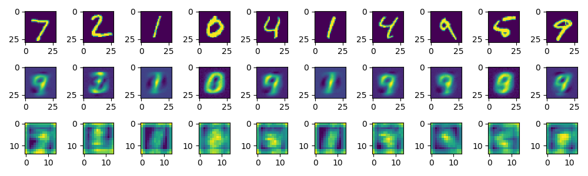
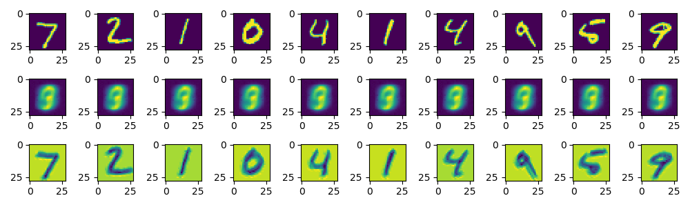

<h1>CNN encoder

first raw of output is original image, 2nd is the image after autoencoder, 3rd is the 2nd feature map after 2 layers convolution

Compared to rnn autoencoder and normal encoder cnn shows a worse copied task but inder middle layer even if overfit the features still keep well.
It gives a solution to mimic gan

results:
	normal case 

	overfit

